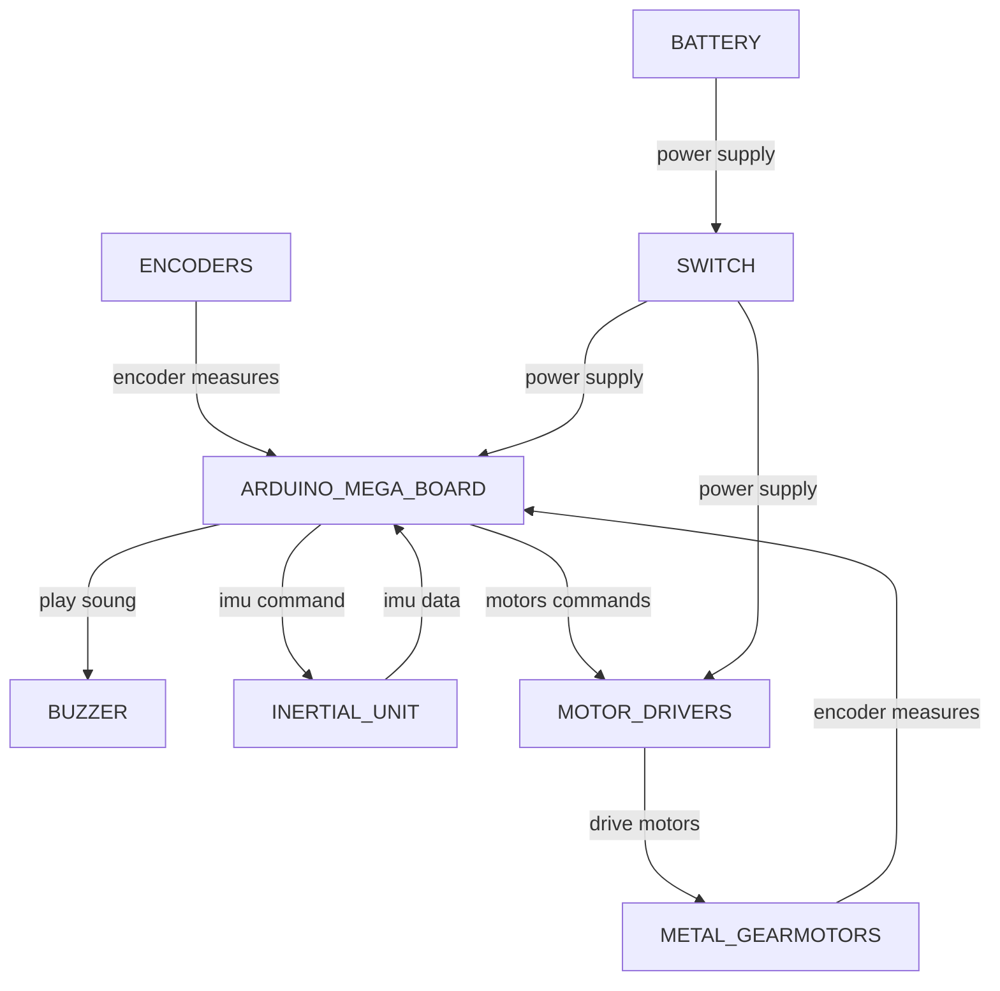

#  Tbot Diagram:

```mermaid
graph TD;
  ARDUINO_MEGA_BOARD  -- play soung       --->  BUZZER
  ARDUINO_MEGA_BOARD  -- imu command      --->  INERTIAL_UNIT
  ARDUINO_MEGA_BOARD  -- motors commands  --->  MOTOR_DRIVERS
  INERTIAL_UNIT       -- imu data         --->  ARDUINO_MEGA_BOARD
  MOTOR_DRIVERS       -- drive motors     --->  METAL_GEARMOTORS
  METAL_GEARMOTORS    -- encoder measures --->  ARDUINO_MEGA_BOARD
  ENCODERS            -- encoder measures --->  ARDUINO_MEGA_BOARD
  SWITCH              -- power supply     --->  ARDUINO_MEGA_BOARD
  SWITCH              -- power supply     --->  MOTOR_DRIVERS
  BATTERY             -- power supply     --->  SWITCH
```
